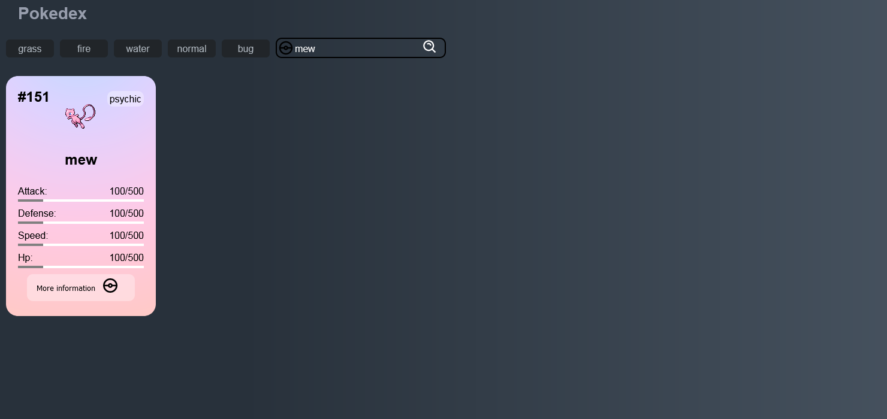
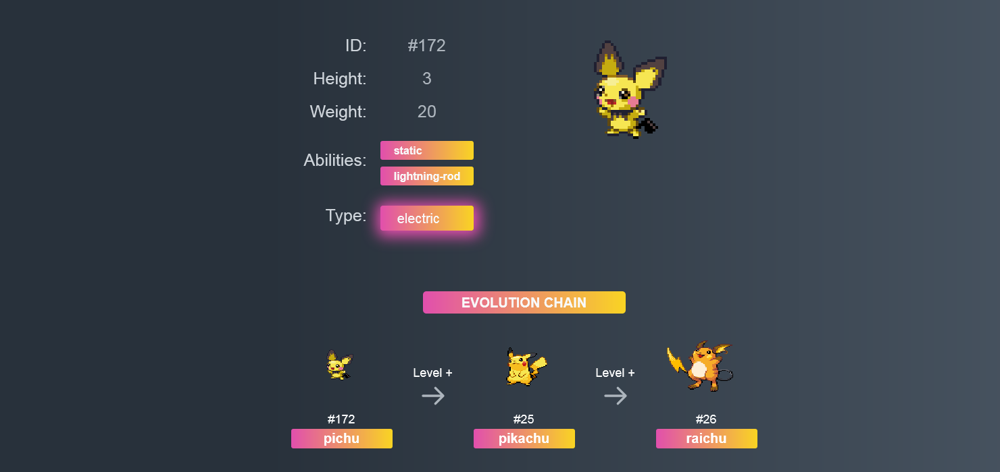

<h1 >
    Pokedex
</h1>

<div align="center">
    
</div>

---

# 📌 Screenshots
<div align="center">
  
  
  
  
  
</div>

<p align="center" target="_blank">
    Made with 💜 by Vinicius Jose
</p>

# Technologies Used
<p>
    This project was developed with the following technologies:
</p>

- Javascript
- React
- React-router-dom
- React-icons
- Styled-components
- Axios
- PokeApi
- Redux

---

## ❤️ The Project
I did this project as a means to improve my studies in React, it consists of a pokedex, with information from pokemon, Built using the **PokéAPI**.

# Description
I developed this application to reinforce my studies in react and styled-components, in it I made 3 pages, Home, Pokemon and Page 404.

This application was developed in react, in it I used styled-components to do all the design of the pokemons cards, which made me have a better understanding of the library. I also used react-router-dom to make routes and filters for pokemons, and used axios to get data from PokeApi

---

# Executing the Project

#### Cloning the project

```bash
    $ git clone https://github.com/zV1N1/pokedex-react-app.git

    # Go into the repository
    $ cd pokedex

    # Install dependencies
    $ yarn install

    # Run the app
    $ yarn start
```

# Credits
Thanks to [PokéAPI.co](https://github.com/PokeAPI/pokeapi) for the data.

---

<h4 align="center"> <em>&lt;/&gt;</em> by <a href="https://github.com/zV1N1" target="_blank">zV1N1</a> </h4>
